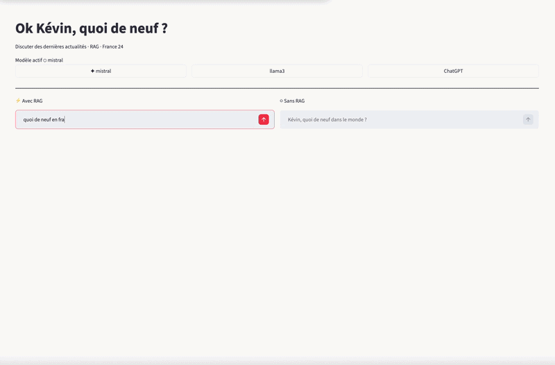

# ActuLLM

ActuLLM is a small multi-service news assistant project that compares answers **with RAG** and **without RAG**.
It ingests France 24 RSS news, stores vectors in ChromaDB, and queries an LLM through an Ollama gateway.

## Demo



## Features

- News ingestion from France 24 RSS feeds (`rss_file.py`)
- Article API (`Api_add_articles.py`)
- Retrieval + prompt orchestration (`C3.py`)
- LLM gateway to Ollama (`Api_LLM.py`)
- Front API route (`api_front.py`)
- Streamlit UI comparing RAG vs non-RAG (`app.py`)

## Project structure

- `app.py`: Streamlit UI
- `api_front.py`: FastAPI endpoint `/ask` (front orchestrator)
- `C3.py`: FastAPI endpoint `/process` (retrieve docs + build prompt)
- `Api_LLM.py`: FastAPI endpoint `/generate` (calls Ollama)
- `Api_add_articles.py`: article storage API
- `defconn.py`: ChromaDB connection helper
- `rss_file.py`: RSS fetch script that writes `news.json`
- `start.sh`: runs FastAPI services on ports `8002`, `8004`, `8005`

## Prerequisites

- Python 3.10+
- Ollama running on `http://localhost:11434`
- ChromaDB HTTP server running on `localhost:8000`

## Quick start

### Option 1: Docker (as currently configured)

```bash
docker-compose up --build
```

### Option 2: Local development

```bash
python -m venv venv
source venv/bin/activate
pip install -r requirements.txt
```

Start backend services:

```bash
./start.sh
```

In another terminal, start the Streamlit app:

```bash
streamlit run app.py
```

## API endpoints

- `POST /ask` on port `8002`
- `POST /process` on port `8004`
- `POST /generate` on port `8005`
- `GET /get_articles` and `POST /get_articles` on port `8001`

## Notes

- Default prompt/assistant responses are currently designed in French.
- The repository contains a duplicated subfolder `Actullm/` with similar files.
